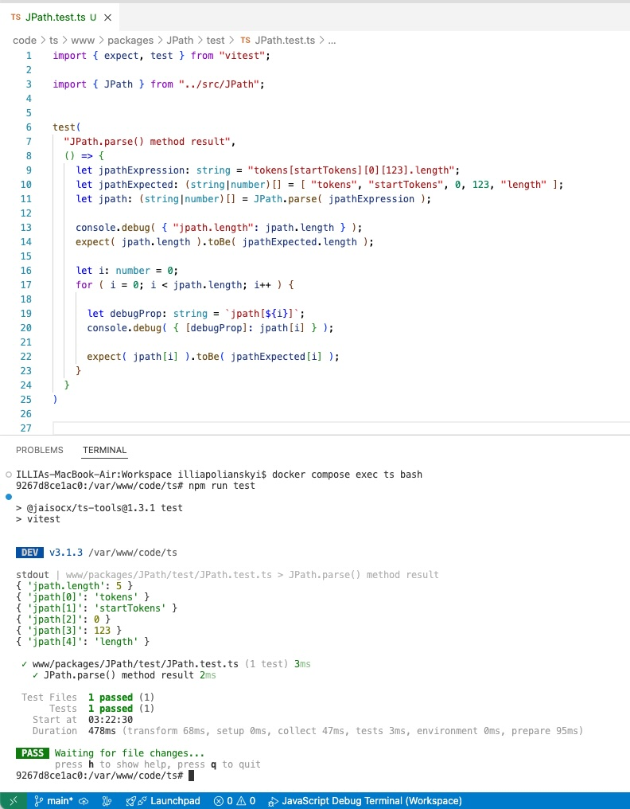

# NEWS

[README.md HOME](./../../README.md)


## News: 13th of May 2025

#### 1. Vitest Testing Framework applied in this project.

*The very very nice user experience at the first site. Installed via npm like a charm, first test written ran at once, no need no project rebuild. Found the bug thanks to the Vitest test ran, and bugfixed then. The very very nice testing framework.*




1. To update Your project:

```
docker compose exec ts bash
cd /var/www/code/ts
npm install
```

2. A test available: `code/ts/www/packages/JPath/test/JPath.test.ts`

3. To run tests:

```
docker compose exec ts bash
cd /var/www/code/ts
npm run test
```

4. After tests have been run, when no need watcher to run tests every changes made to *.test.ts files, to exit Vitest watch test mode: press the key "q"


## News: 12th of May 2025

1. Datasets published for Sites quality improvals, to use on CDN too, to lookup countries codes and languages names and codes.


[https://workspace.brightday.email/CharsetsDetectionRelevantDatasetsPreview.html](https://workspace.brightday.email/CharsetsDetectionRelevantDatasetsPreview.html)


2. Upgraded typescript packages to the newest ver.

To update Your project:

```
docker compose exec ts bash
cd /var/www/code/ts
npm install
```


## News: May 2025. 

1. New npm Package **EmailHtmlInliner** `@jaisocx/email-html-inliner` and site to watch The Inliner in action: [https://workspace.brightday.email/packages/EmailHtmlInliner/EmailHtmlInliner_Images.html](https://workspace.brightday.email/packages/EmailHtmlInliner/EmailHtmlInliner_Images.html)


2. Stricter tsconfig.json rules. Checks unused variables. Wen You have to invoke the callback and don't use the callback's in arg, the workaround is to prefix the method's in arg name with the underscore symbol. 

```
addEventHandler(
  eventName,
  ( _eventName: string, payload: any ) => {

    // the _eventName var is never written in this callback.
    // when not _ prefixed, the tsc typescript transpiler throws exception and exits.

    console.log( payload );
  }
);
```


3. Since now this project is of great use when You **develop and push to npm CSS tools and themes**, too, thanks to the new features `css-importer` and fine tuning of package.json working examples and project's config for Webpack builds.


4. How to build **Your CDN example** with The [Jaisocx.com](https://jaisocx.com/) Sites Server in `docker-compose.yml` and `.docker/https/conf/http-conf.xml`


5. **Renamings**: in the www folder, the most `examples` were moved to the new `webpack_builds`. Why: the examples were just the webpack builds with no other features or funcs. That is why they are just webpack builds as they are.

    5.1. In ts packages, renamed were: 
    
    5.1. `assets` -> `MediaAndStyles`. **Assets** is the keyword in Online Banking apps. **Styles** is the keyword in Sites development since 1990th. 
    
    5.2. `build` -> `transpiled`. **Transpile** is the keyword of The Typescript Language, and **build** is the keyword of The Webpack Tool.


6. **Fine Tuning ProjectBuilder's Config**. In the config file `BuildData.json` there are new features to fine tune the ts build.

    6.1. `build-simple-enable` works. Turns on writes .js files listed in `"build-files"`. Path is: `${packageRoot}/transpiled/Simple`.
      
    6.2. `css-importer`: packs on demand all .css files to one `"cssTargetFilePath"`, if all other .css files were referenced in the `"cssFilePath"` via @import url("styles-filename.css");


### 7. The new template "ResponsiveAndValidForWebpackWhenNpmInstall"


`code/ts/www/templates/ResponsiveAndValidForWebpackWhenNpmInstall`


Just **copy paste** to start a **new** npm ts | js package **from scratch**. There are just package.json and .js files for the webpack feature.


This template is developed for the nice workaround to publish on **npm webpack aliases** when aimed to set this npm package available in other ts tools for builds there with The Webpack to `bundle.js`, when installed there this package via **npm install**. 


Why good to use this template for SitesTools: whenever You planned to import there styles or not, later the imported .css files, images, themes and fonts may be installed and noone knew before. The few .js and .json files in this template will no harm the new package size too extensive.


## News in March 2025. 

1. docker service `ts` was upgraded to v`23.11.0`, npm v`10.9.2` (I experiensed best performance and the documentation tells about new typescript files run feature available after v23.6.0) You need to rebuild the `ts` service.
```
docker compose stop ts
docker compose rm ts
docker compose build ts
docker compose up ts -d
```

