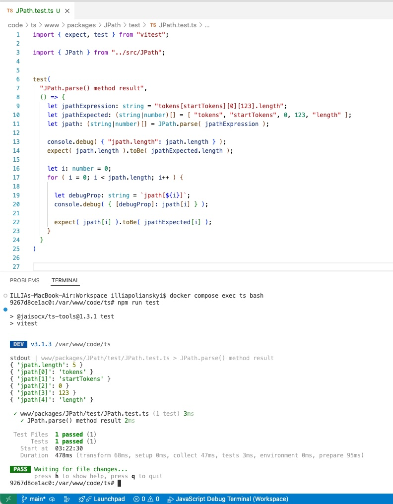

# Vitest Testing Framework applied in this project.

[README.md HOME](./../../README.md)


*The very very nice user experience at the first site. Installed via npm like a charm, first test written ran at once, no need no project rebuild. Found the bug thanks to the Vitest test ran, and bugfixed then. The very very nice testing framework.*


A test example available: `workspace/ts/www/packages/JPath/test/JPath.test.ts`





2. To run tests:

```
docker compose exec ts bash
cd /var/www/workspace/ts

## via script in package.json:
##   why good: when didn't know instruction "npx vitest run",
##   the normal way to lookup for scripts in package.json for sure))
npm run test

## or, in watch mode:
# npm run test-watch


## via npx command line tool:
# npx vitest run

## or, in watch mode:
# npx vitest
```

